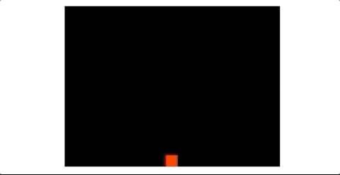

# Undertale WebGL

Undertale WebGL - An undertale fighting mechanics wannabe, made in WebGL. If you don't know Undertale (you missed out a great game),
please see [this video](https://youtu.be/6RL6JcEHw2U?t=130) which showcase how the fighting mechanics in Undertale works.

## Disclaimer

This project is for learning purpose. I have **never** used pure WebGL before doing this. I know there are many libraries out there such as ThreeJS or BabylonJS, but for maximum gain in learning, I decided to opt out of any libraries. Also, I don't care about any licensing, copy this code if you want, claim this, I don't really care.

## Folder structure

There's not much of a unique folder structure here, I just separated them based on what's inside the script.

## Requirements

1. **ESS6 Module Browser**: To eliminate any hassle, I decided it is best to not use any transpiler or any such, see [caniuse](https://caniuse.com/es6-module)
2. **WebGL supported Browser**: Duh.. See [here](https://caniuse.com/webgl)
3. **HTML Canvas supported browser**: Self explanatory, again, see [here](https://caniuse.com/canvas)

## Workflow

After you make sure you support all the of the requirements above (if you don't, please update your browser man..), just open the `index.html`

## Improvements to do if I have the whole time in the world

- Obviously, type system will be nice, probably TypeScript.
- Proper game engine architecture. I've delved around Unity & Godot in the past, but never really know how to build a proper one.
- Destroying game objects (enemies) if they're outside the screen.
- Proper pause, play, and reset button. I didn't have time to learn how to manipulate all of the WebGL rendering context.
- More levels!
- Proper game manager Class to handle level changes or anything.

---
